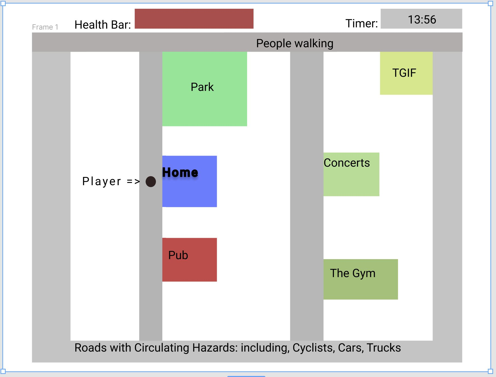

# Welcome to **Pandemic Survival simulation!**
Sign Commit Test 2

Live Deployment: https://hectorzaragoza.github.io/SEI-Project-One/

## In this game,
you'll have to **survive** a day in **Mexico City**. (Mix of [The Sims](https://www.youtube.com/watch?v=qqjqPheQvSU) and [Gather Town](https://www.youtube.com/watch?v=8orexZsFRxs))

* evading crazy traffic
* keeping yourself alive to visit a park, the beach, or a bar.

## Game Objective:
* Keep your Health bar above 0 by visiting places that nourish you: 
    - Park
    - Beach
    - Concert Venue
* Avoid Hazards:
    - Cyclists
    - Cars
    - Motorcycles
    - Trucks

* Other "Hazards":
    - Pub

## Technical Stack and Requirements:
* HTML5
* CSS3/Bootstrap
* JavaScript (ES6)
* Canvas

## Minimum Viable Product (MVP):

1. Display a sky view of a town grid image with pathways and establishments
2. Display Health Bar
3. Different Places/Hazards will fill/drain your health bar. 
4. Display moving hazards at different speeds.
6. Win Conditions
- Leave your home and visit a place and return home before your health runs out.
7. End Game Conditions: 
- You collide with a Hazard
- Your health reaches 0 while you're away from home or a sanctuary.

## Stretch goals:
1. Add sounds/music to establishments
2. Sound Level is dependent on proximity to sound source
3. Illustrate image of the town.
4. Add a loading screen animation
5. Add an end screen with a summary log of places you visited and how long you were there at the end of the day.
